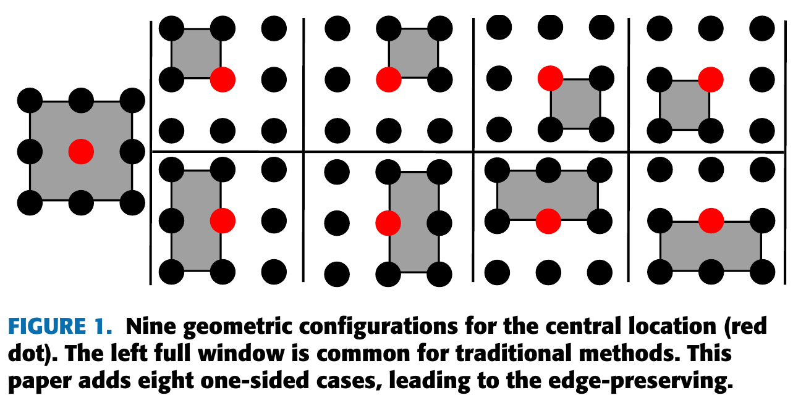

# [Paper](https://ieeexplore.ieee.org/document/10942596) $~~~~$ [Code](main.cpp)
# One-Sided Box Filter 
1) preserves edges
2) has high computation performance
## Perform on nine cases and select the best one

## As a result, this filter preserves edges

From left to right: original, iteration=10, iteration=100 and iteration=1000
## This filter is the fastest among all edge-preserving methods. Its running time is only about 4X of box filter running time.
```text
@ARTICLE{osbf,
  author={Gong, Yuanhao},
  journal={IEEE Access}, 
  title={OSBF: One-Sided Box Filter for Edge-preserving Image Processing}, 
  year={2025},
  volume={13},
  number={},
  pages={61149-61160},
  doi={10.1109/ACCESS.2025.3555434}}
```
